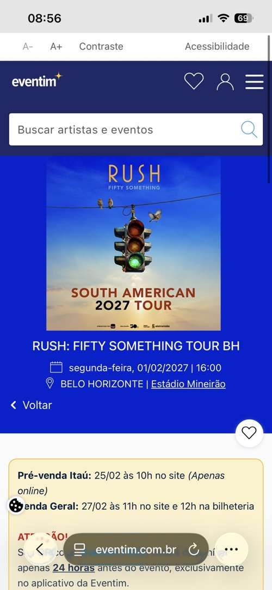

# Benchmarking

Para compreender soluções existentes no segmento de eventos e ingressos, foram selecionadas três referências reais: **Sympla, Even3 e EVENTIM**.

A seleção foi intencional: a Sympla representa uma solução ampla de gestão e venda de ingressos; a Even3 oferece forte referência em eventos acadêmicos e científicos; e a EVENTIM foi analisada pela experiência de compra de ingressos para um grande evento.

## 1. Sympla

**Plataforma responsável:** Sympla.

**Público atendido:** produtores/organizadores e participantes de diferentes tipos de eventos.

**Principais funcionalidades observadas:** criação e publicação de eventos, configuração de ingressos e lotes, grupos de ingressos, virada automática de lote, dashboard, gestão financeira, acompanhamento de vendas, gestão de participantes e check-in.

**Pontos positivos:** centralização da gestão, variedade de recursos para o organizador, controle de lotes e acompanhamento operacional.

**Ponto negativo identificado:** a amplitude de recursos pode ser maior do que a necessidade de um organizador que pretende realizar um evento pequeno e simples.

**Motivo da escolha:** é uma referência brasileira diretamente relacionada às funcionalidades previstas para o EventFlow, especialmente gestão de eventos, ingressos, lotes e acompanhamento do organizador.

**Referência para o EventFlow:** organização das informações do evento, estrutura de lotes e visão de gerenciamento.

### Evidência da pesquisa

*Figura 1 — Tela da Sympla utilizada como evidência da pesquisa. A captura demonstra a área de descoberta de eventos, busca por experiências, destaque de eventos e organização por coleções/categorias.*

Fonte: https://www.sympla.com.br/ e páginas institucionais da plataforma. Pesquisa realizada em 15/09/2026.

---

## 2. Even3

**Plataforma responsável:** Even3.

**Público atendido:** organizadores e participantes, com forte direcionamento a eventos científicos e acadêmicos.

**Principais funcionalidades observadas:** inscrições, venda de ingressos, lotes e cupons, gestão do evento, programação e atividades, credenciamento por QR Code, certificados, submissão de trabalhos, pesquisa de satisfação e relatórios.

**Pontos positivos:** boa aderência ao contexto universitário, centralização das etapas do evento e recursos de credenciamento e pós-evento.

**Ponto negativo identificado:** funcionalidades específicas, como submissão de trabalhos e certificados, podem ser desnecessárias para eventos mais simples.

**Motivo da escolha:** foi selecionada por sua forte atuação em eventos acadêmicos, contexto diretamente relacionado ao público inicial proposto para o EventFlow.

**Referência para o EventFlow:** organização das inscrições, controle de participantes e estrutura de eventos acadêmicos.

### Evidência da pesquisa

*Figura 2 — Tela da Even3 utilizada como evidência da pesquisa. A captura demonstra a descoberta de eventos relevantes por área e a apresentação de informações como data e localização.*

Fonte: https://www.even3.com.br/ e páginas institucionais da plataforma. Pesquisa realizada em 15/09/2026.

---

## 3. EVENTIM

**Plataforma responsável:** EVENTIM.

**Referência analisada:** Rush: Fifty Something Tour — Estádio Mineirão, Belo Horizonte.

**Público atendido:** participantes interessados na aquisição de ingressos para shows e grandes eventos.

**Principais funcionalidades/informações observadas:** apresentação de data, local, setores/categorias de ingresso e diferentes valores, com foco na seleção e aquisição de ingressos.

**Pontos positivos:** destaque para informações essenciais do evento e organização das opções de ingresso por categoria/setor.

**Ponto negativo identificado:** em grandes eventos, a existência de muitos setores, categorias, condições e valores pode tornar a escolha mais complexa para o participante.

**Motivo da escolha:** a EVENTIM foi selecionada para estudar principalmente a perspectiva do comprador e a forma de apresentar opções de ingresso em um evento de grande porte.

**Referência para o EventFlow:** apresentação objetiva de data/local e organização das alternativas de ingresso.

### Evidência da pesquisa

*Figura 3 — Página do evento Rush: Fifty Something Tour BH utilizada como evidência da pesquisa. A captura demonstra o destaque visual do evento e a apresentação imediata de informações como nome, data, horário e local.*

Fonte: https://www.eventim.com.br/event/rush-fifty-something-tour-estadio-mineirao-21331264/ . Pesquisa realizada em 15/09/2026.

---

# Matriz comparativa

| Critério | Sympla | Even3 | EVENTIM |
|---|---|---|---|
| Foco observado | Gestão ampla de eventos | Eventos acadêmicos e científicos | Venda de ingressos para grandes eventos |
| Organizadores | Forte | Forte | Não foi o foco da página analisada |
| Participantes | Sim | Sim | Forte |
| Ingressos/inscrições | Sim | Sim | Sim |
| Lotes/categorias | Sim | Sim | Categorias/setores |
| Gestão/dashboard | Sim | Sim | Não analisado |
| Credenciamento | Check-in | QR Code e credenciamento | Acesso por ingresso |
| Principal inspiração | Gestão e lotes | Inscrição e contexto acadêmico | Experiência de compra |

# Aprendizados

A análise mostrou que uma plataforma de eventos precisa equilibrar duas experiências. O **organizador** necessita de controle, configuração e acompanhamento; o **participante** precisa de clareza, disponibilidade e poucos passos para chegar ao ingresso.

Da **Sympla**, o EventFlow utilizará como referência a gestão de eventos, lotes e visão do organizador. Da **Even3**, serão aproveitadas referências de organização de inscrições e aderência ao ambiente acadêmico. Da **EVENTIM**, a principal referência será a apresentação das informações do evento e das opções de ingresso.

## Oportunidade identificada

Construir uma solução inicialmente mais simples, combinando **gestão eficiente para o organizador** com **aquisição objetiva para o participante**, sem tentar reproduzir todas as funcionalidades das plataformas analisadas.

# Evidências da pesquisa

As três capturas realizadas durante a pesquisa estão armazenadas no próprio repositório em `docs/benchmarking/evidencias/` e foram incorporadas às respectivas análises acima.